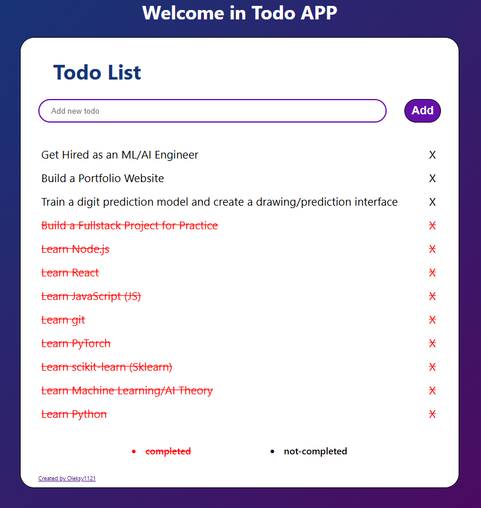

# MERN To-Do Application

A simple full-stack To-Do application built using the MERN stack (MongoDB, Express.js, React, Node.js). This project allows users to add, view, update, and delete tasks.

## Technologies Used

**Backend:**
* Node.js
* Express.js
* MongoDB (with Mongoose ODM)
* dotenv (for environment variables)
* cors (for handling Cross-Origin Resource Sharing)
* axios (used in the frontend to make API calls)

**Frontend:**
* React
* Styled Components (for styling)
* axios (for making API calls to the backend)

**Deployment/Containerization:**
* Docker
* Docker Compose

## Prerequisites
Before you begin, ensure you have the following installed:

* Node.js (includes npm) - [https://nodejs.org/](https://nodejs.org/)
* npm or Yarn - npm is included with Node.js; Yarn can be installed separately: [https://yarnpkg.com/](https://yarnpkg.com/)
* Docker Desktop (includes Docker Engine and Docker Compose) - [https://www.docker.com/products/docker-desktop/](https://www.docker.com/products/docker-desktop/)


## Preview


## Getting Started

Follow these steps to set up and run the project locally.

### 1. Clone the Repository

If you haven't already, clone the project repository from GitHub:

```bash
git clone <Your-Repository-URL>
cd <Your-Repository-Name> 
```
### 2. Setup Backend
Navigate to the backend directory, install dependencies, and set up environment variables.


```bash
cd todo-backend
npm install # or yarn install
```
Create a .env file in the todo-backend directory and add your MongoDB connection string and desired port:

```
MONGO_URL=<Your-MongoDB-Connection-String>
PORT=8000 # Or any other port you prefer
```
### 3. Build and Run the Application using Docker Compose
Ensure you are in the root directory of the project (where docker-compose.yml is located).

```bash
# Build the Docker images for both backend and frontend, and start the containers in detached mode.
# --build ensures images are built/rebuilt based on your Dockerfiles.
docker-compose up -d --build
```
**Note:** The first time you run this, Docker will download base images and build your application images, which may take some time. Subsequent runs will be faster due to Docker's build cache.

### 4. Access the Application
Once the containers are up and running, open your web browser and navigate to:

http://localhost:3000

To-Do application should now be accessible. The frontend will communicate with the backend running within the Docker network.


### 5. Managing the Dockerized Application
* **To stop the application:**
  ```bash
  docker-compose stop
  ```
* **To stop and remove containers, networks, and images (if not used by other projects):**
  ```bash
  docker-compose down
  ```
* **To rebuild images after code changes (e.g., in todo-backend or todo-frontend):**
  ```bash
  docker-compose up -d --build
  ```

This will ensure your latest code is incorporated into the running containers.

## API Endpoints
The backend provides the following API endpoints for managing todos:

- `GET /todos`: Get all todo tasks.
- `POST /todos`: Create a new todo task. 
- `PUT /todos/:id`: Update a specific todo task by ID. Expects ID in the URL parameter.
- `DELETE /todos/:id`: Delete a specific todo task by ID. Expects ID in the URL parameter.

## Project Structure
The project is organized into two main directories:

- todo-backend/: Contains the Node.js/Express server code, Mongoose models, and API controllers.
- todo-frontend/: Contains the React application code, including components and styles.


## Future Improvements
Potential areas for further development include:

- Implementing full update functionality (editing task text).
- Adding user authentication and authorization.
- Improving UI/UX design and adding animations.
- Adding more detailed error handling and user feedback.
- Implementing filtering and sorting of tasks.
- Adding due dates or priorities to tasks.